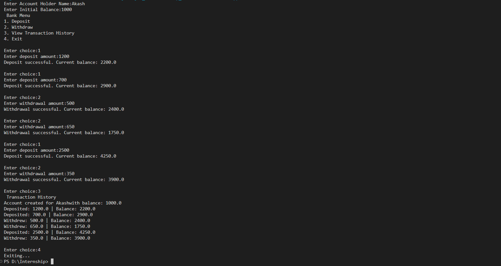

# Bank Account Simulation

## 📌 Objective
A simple Java program that simulates basic bank operations such as deposit, withdrawal, and transaction history using **Object-Oriented Programming (OOP)** concepts.

---

## 🚀 Features
- Create a bank account with an initial balance.
- Deposit money into the account.
- Withdraw money with balance validation.
- View complete transaction history.
- Menu-driven console application.

---

## 🚀 Features
- Create a bank account with an initial balance.
- Deposit money into the account.
- Withdraw money with balance validation.
- View complete transaction history.
- Menu-driven console application.

---

## 📜 How It Works
1. **Account Creation**  
   - User enters their name and initial balance.
   - Account is created with transaction history initialized.

2. **Deposit**  
   - User can deposit a positive amount.
   - Balance updates and transaction is recorded.

3. **Withdraw**  
   - User can withdraw money if balance is sufficient.
   - Balance updates and transaction is recorded.

4. **View Transaction History**  
   - Shows all deposits and withdrawals since account creation.

---

## 🖥 Example Output

 

